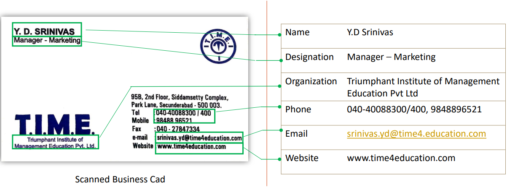

## Table of Contents
- [Description](#description)
- [Idea](#idea)
- [Design System](#design-system)
- [Installation](#installation)
- [Run Application](#run-application)
- [Contact](#contact)

# Description
In this project, we will develop a Customized Named Entity Recognizer. The main idea of this project is to extract entities from scanned documents such as invoices,business cards, shipping bills, bills of lading, etc. However, due to data privacy reasons, we will focus only on business cards. But we can use the explained framework to handle all types of financial documents. Below is the development process that we will follow in the project. Todevelop this project, we will use two main technologies in data science :
- Computer Vision: In Computer Vision module, we will scan the document, identify the location of text and finally extract text from the image.
- Natural Language Processing: Then in Natural language processing, we will extract the entitles from the text and do necessary text cleaning and parse the entities form the text.
Since we are combining two main technologies to develop the project, to make it easier to understand, we will divide the project into different stages of development.
- Stage 1: We will setup the project by doing the necessary installations and requirements.
- Stage 2: We will do data preparation. That is we will extract text from images using Pytesseract and also do necessary cleaning.
- Stage 3: We will see how to label NER data using BIO tagging.
- Stage 4: We will further clean the text and preprocess the data for to train machine learning.
- Stage 5: With the preprocess data we will train the Named Entity model.
- Stage 6: We will predict the entitles using NER and model and create data pipeline for parsing
        text.
# Idea

# Design System


# Installation
### Create Virtual Environment
Then create new environment where contain nessessary packages to this project.
Ensure you have Python 3.9+ installed.
```cmd
python -m venv .venv
```
Activate new enviroment
```cmd
.venv\Scripts\activate
```
Then, install the required dependencies using pip:
```cmd
pip install -r requirements.txt
```

# Run Application
All done! To run the application, start the Django server and the React development server
In 2 separate terminals, make sure you’re in the root directory of your Django project, run:
```cmd
python manage.py runserver
```
and in the frontend directory, run:
```cmd
cd frontend
npm run dev
```
Visit the URL shown in your terminal (usually http://localhost:5173/) to view the app.

# Contact
For questions, contributions, or bug reports, please feel free to reach out:

- Email: [hoangcongtrong02.dut@gmail.com](hoangcongtrong02.dut@gmail.com)
- Linkedin: [https://www.linkedin.com/in/hoangtrong151102/](https://www.linkedin.com/in/hoangtrong151102/)
- Instagram: [https://www.instagram.com/h.c.trong_02/](https://www.instagram.com/h.c.trong_02/)

I appreciate your feedback and involvement!


